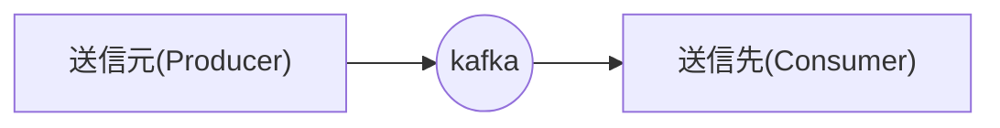
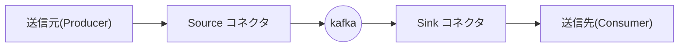
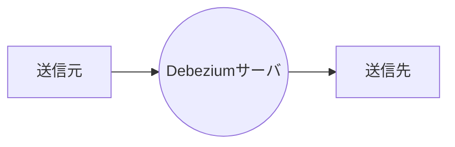

```mermaid
flowchart LR
    Producer["送信元(Producer)"] --> Kafka((kafka))
    Kafka --> Consumer["送信先(Consumer)"]
```

```mermaid
flowchart LR
    Producer["送信元(Producer)"] --> Source["Source コネクタ"]
    Source --> Kafka((kafka))
    Kafka --> Sink["Sink コネクタ"]
    Sink --> Consumer["送信先(Consumer)"]
```

```mermaid
flowchart LR
    Producer["送信元"] --> Debezium((Debeziumサーバ))
    Debezium --> Consumer["送信先"]
```
